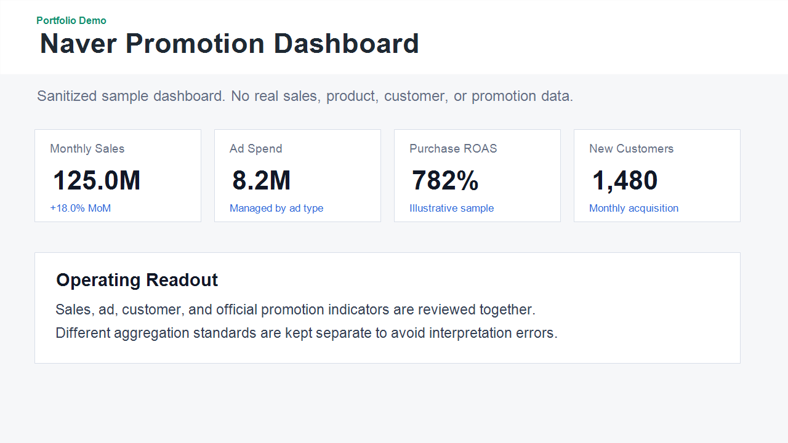
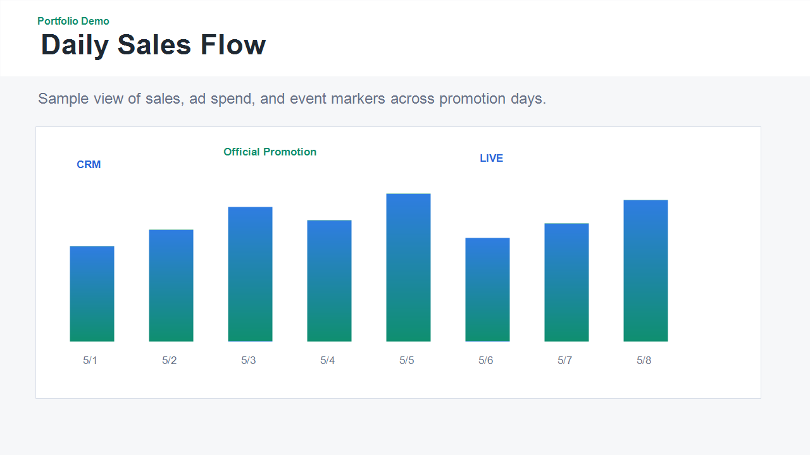
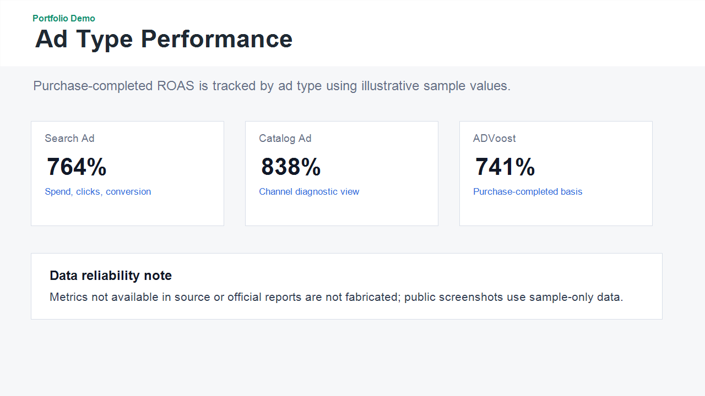

# Naver Promotion Dashboard Portfolio

네이버 스마트스토어의 판매성과, 광고성과, 고객현황, 공식 프로모션 성과를 통합해 월간 Sell-out 운영 의사결정을 지원하기 위해 구축한 대시보드 프로젝트입니다.

이 저장소는 포트폴리오 공개용 버전입니다. 실제 운영 원본 데이터, 상품 식별자, 가격/할인 조건, 공식 리포트 원본, Google Apps Script 배포 번들은 포함하지 않습니다.

## Business Context

기존에는 판매성과, 광고성과, 고객현황, 공식 프로모션 성과가 각각 다른 파일과 화면에 분산되어 있어 프로모션별 성과, 광고 효율, 신규고객 유입, 일자별 매출 흐름을 한 번에 판단하기 어려웠습니다.

이 프로젝트는 온라인 채널 운영자가 매일 확인해야 하는 KPI를 정의하고, 원본 데이터에서 데이터마트를 생성한 뒤 대시보드로 연결해 운영 액션을 빠르게 판단할 수 있도록 만든 사례입니다.

## Problem

- 판매성과, 광고성과, 고객현황, 공식 프로모션 성과가 분산되어 월간 성과 리뷰에 시간이 걸림
- 공식 프로모션 성과와 전체 일매출의 집계 기준이 달라 단순 합산 시 해석 오류가 발생할 수 있음
- 광고 효율을 단순 클릭 기준이 아니라 구매완료 기준으로 관리할 필요가 있음
- 프로모션, CRM, LIVE 이벤트가 일자별 매출 흐름에 어떤 영향을 주는지 한 화면에서 보기 어려움

## Solution

- 원본 Excel과 공식 프로모션 PDF는 수정하지 않고 별도 관리
- Python 스크립트로 필요한 지표를 추출해 대시보드용 데이터마트 JSON 생성
- HTML/JavaScript 기반 대시보드로 핵심 KPI, 일자별 흐름, 광고 타입별 성과, 공식 프로모션 성과를 시각화
- Google Apps Script 배포용 번들을 별도 생성해 내부 공유 가능한 구조로 설계
- 공개 버전에서는 실제 데이터 대신 구조, 문서, 예시 스키마만 제공

## Key Dashboard Sections

- Executive Summary: 월간 핵심 KPI와 전월 대비 변화
- Daily Sales Flow: 일자별 매출, 광고비, 공식 프로모션, CRM, LIVE 이벤트 흐름
- Official Promotion Performance: 네이버 공식 프로모션 성과
- Promotion Impact Summary: 프로모션 기간과 비교 기간의 성과 차이
- Daily Funnel: 유입, 전환율, 광고 CTR/CVR 흐름
- Ad Type Performance: 검색광고, 카탈로그광고, ADVoost별 광고비, 매출, ROAS
- Daily Channel Diagnostics: 유입채널 및 채널매출 분석
- Hourly Sales Heatmap: 판매시간별 매출 및 결제건수 히트맵
- Customer Trend: 신규/기존 고객 및 라운지 회원 증가 추세

## Data Reliability Policy

- 원본 Excel과 공식 프로모션 PDF는 수정하지 않습니다.
- 공식 프로모션 성과와 전체 일매출은 집계 기준이 다를 수 있어 단순 합산하지 않습니다.
- 원본 데이터 또는 공식 성과자료에 없는 지표는 임의 생성하지 않습니다.
- 대시보드는 운영 의사결정을 위한 내부 분석용으로 사용하며, 외부 공유 시 민감 데이터는 마스킹합니다.

## Security / Privacy Notice

공개 저장소에는 아래 항목을 포함하지 않습니다.

- 상품 ID 및 상품명
- 내부 가격 스킴, 할인율, 쿠폰 조건
- 공식 프로모션 PDF 원본
- 원본 Excel 파일명과 원본 데이터
- 회사 내부 운영 메모
- 실제 데이터가 내장된 Google Apps Script 배포 파일

## Portfolio Relevance

이 프로젝트는 단순 시각화가 아니라, 온라인 채널 운영자가 필요한 KPI를 직접 정의하고 이를 반복 가능한 대시보드로 구현한 사례입니다.

Online Operation & Strategy 직무에서 요구되는 Sell-out KPI 관리, 프로모션 활용도 분석, 광고 효율 관리, 데이터 기반 의사결정 역량을 보여주는 증빙자료로 활용할 수 있습니다.

## Screenshots

> 실제 운영 데이터가 아닌 sanitized sample 화면입니다. 실제 상품, 가격, 고객, 광고, 프로모션 데이터는 포함하지 않습니다.





## Repository Structure

```text
docs/
  evidence_summary.md       # 채용/포트폴리오용 핵심 증빙 요약
  security_publication.md   # 공개 범위와 민감정보 제외 기준
  screenshots/              # 공개용 샘플 데모 화면 캡처
data/
  dashboard_data.sample.json # 공개 가능한 예시 데이터 스키마
scripts/
  build_sample_datamart.py  # 예시 데이터 생성 스크립트
requirements.txt
```

## Run Sample

```bash
pip install -r requirements.txt
python scripts/build_sample_datamart.py
```

생성 결과는 `data/dashboard_data.sample.json`에 저장됩니다.

## Original Project

원본 프로젝트는 실제 운영 데이터 기반으로 작성되었기 때문에 비공개로 유지합니다. 이 공개 저장소는 채용 포트폴리오 제출을 위해 민감정보를 제거하고 프로젝트 목적, 설계 방식, 데이터 신뢰성 기준을 설명하는 버전입니다.
